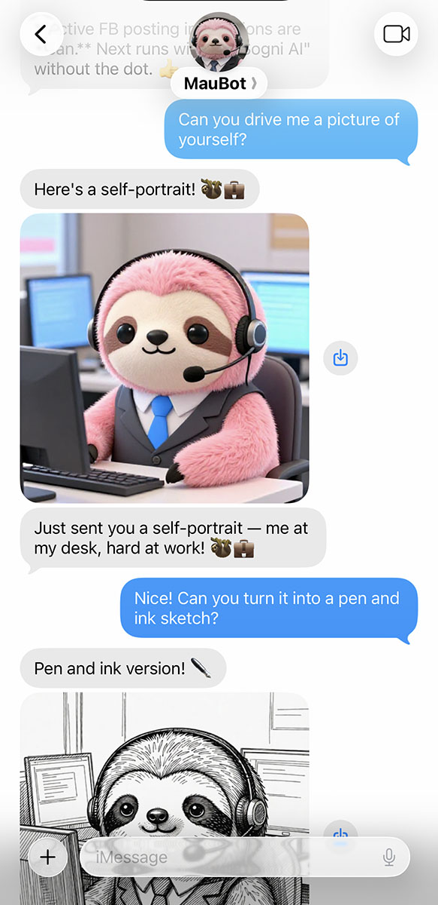

<p align="center">
  
</p>

# Image & Video gen for 🦞 OpenClaw

🎨 Generate **images and videos** using [Sogni AI](https://sogni.ai)'s decentralized GPU network.

An [OpenClaw](https://github.com/OpenClaw/OpenClaw) plugin for AI image + video generation.

## Installation

### Quick Install (OpenClaw) - Recommended

This repo ships an `openclaw.plugin.json` manifest so OpenClaw can automatically download and set everything up:

```bash
# One command to install from GitHub
openclaw plugins install git@github.com:Sogni-AI/moltbot-sogni-gen.git

# Or if published to npm
openclaw plugins install sogni-gen
```

That's it! OpenClaw will handle the rest.

### Manual Installation

```bash
# Clone the repository
git clone git@github.com:Sogni-AI/moltbot-sogni-gen.git
cd moltbot-sogni-gen
npm install
```

### OpenClaw Config Defaults

If OpenClaw loads this plugin, `sogni-gen` will read defaults from your OpenClaw config:

```json
{
  "plugins": {
    "entries": {
      "sogni-gen": {
        "enabled": true,
        "config": {
          "defaultImageModel": "z_image_turbo_bf16",
          "defaultEditModel": "qwen_image_edit_2511_fp8_lightning",
          "videoModels": {
            "t2v": "wan_v2.2-14b-fp8_t2v_lightx2v",
            "i2v": "wan_v2.2-14b-fp8_i2v_lightx2v",
            "s2v": "wan_v2.2-14b-fp8_s2v_lightx2v",
            "animate-move": "wan_v2.2-14b-fp8_animate-move_lightx2v",
            "animate-replace": "wan_v2.2-14b-fp8_animate-replace_lightx2v"
          },
          "defaultVideoWorkflow": "t2v",
          "defaultNetwork": "fast",
          "defaultTokenType": "spark",
          "seedStrategy": "prompt-hash",
          "modelDefaults": {
            "flux1-schnell-fp8": { "steps": 4, "guidance": 3.5 },
            "flux2_dev_fp8": { "steps": 20, "guidance": 7.5 }
          },
          "defaultWidth": 768,
          "defaultHeight": 768,
          "defaultCount": 1,
          "defaultFps": 16,
          "defaultDurationSec": 5,
          "defaultImageTimeoutSec": 30,
          "defaultVideoTimeoutSec": 300
        }
      }
    }
  }
}
```

CLI flags always override these defaults.
If your OpenClaw config lives elsewhere, set `OPENCLAW_CONFIG_PATH`.
Seed strategies: `prompt-hash` (deterministic) or `random`.

## Setup

1. Create a Sogni account at https://sogni.ai
2. Create credentials file:

```bash
mkdir -p ~/.config/sogni
cat > ~/.config/sogni/credentials << 'EOF'
SOGNI_USERNAME=your_username
SOGNI_PASSWORD=your_password
EOF
chmod 600 ~/.config/sogni/credentials
```

## Usage

```bash
# Generate image, get URL
node sogni-gen.mjs "a dragon eating tacos"

# Save to file
node sogni-gen.mjs -o dragon.png "a dragon eating tacos"

# JSON output
node sogni-gen.mjs --json "a dragon eating tacos"

# Different model
node sogni-gen.mjs -m flux1-schnell-fp8 "a dragon eating tacos"

# JPG output
node sogni-gen.mjs --output-format jpg -o dragon.jpg "a dragon eating tacos"

# Image edit with LoRA
node sogni-gen.mjs -c subject.jpg --lora sogni_lora_v1 --lora-strength 0.7 \
  "add a neon cyberpunk glow"

# Multiple angles (Qwen + Multiple Angles LoRA)
node sogni-gen.mjs --multi-angle -c subject.jpg \
  --azimuth front-right --elevation eye-level --distance medium \
  --angle-strength 0.9 \
  "studio portrait, same person"

# 360 turntable (8 azimuths)
node sogni-gen.mjs --angles-360 -c subject.jpg --distance medium --elevation eye-level \
  "studio portrait, same person"

# 360 turntable video (looping mp4, uses i2v between angles; requires ffmpeg)
node sogni-gen.mjs --angles-360 --angles-360-video /tmp/turntable.mp4 \
  -c subject.jpg --distance medium --elevation eye-level \
  "studio portrait, same person"

# Text-to-video (t2v)
node sogni-gen.mjs --video "ocean waves at sunset"

# Image-to-video (i2v)
node sogni-gen.mjs --video --ref cat.jpg "gentle camera pan"

# Sound-to-video (s2v)
node sogni-gen.mjs --video --ref face.jpg --ref-audio speech.m4a \
  -m wan_v2.2-14b-fp8_s2v_lightx2v "lip sync talking head"

# Animate (motion transfer)
node sogni-gen.mjs --video --ref subject.jpg --ref-video motion.mp4 \
  --workflow animate-move "transfer motion"

# Estimate video cost (requires --steps)
node sogni-gen.mjs --video --estimate-video-cost --steps 20 \
  -m wan_v2.2-14b-fp8_t2v_lightx2v "ocean waves at sunset"
```

Multi-angle mode auto-builds the `<sks>` prompt and applies the `multiple_angles` LoRA.
`--angles-360-video` generates i2v clips between consecutive angles (including last→first) and concatenates them with ffmpeg for a seamless loop.

## Options

```
-o, --output <path>   Save image to file
-m, --model <id>      Model (default: z_image_turbo_bf16)
-w, --width <px>      Width (default: 512)
-h, --height <px>     Height (default: 512)
-n, --count <num>     Number of images (default: 1)
-t, --timeout <sec>   Timeout (default: 30)
-s, --seed <num>      Specific seed
--last-seed           Reuse last seed
--seed-strategy <s>   random|prompt-hash
--multi-angle         Multiple angles LoRA mode (Qwen Image Edit)
--angles-360          Generate 8 azimuths (front -> front-left)
--angles-360-video    Assemble a looping 360 mp4 using i2v between angles (requires ffmpeg)
--azimuth <key>       front|front-right|right|back-right|back|back-left|left|front-left
--elevation <key>     low-angle|eye-level|elevated|high-angle
--distance <key>      close-up|medium|wide
--angle-strength <n>  LoRA strength for multiple_angles (default: 0.9)
--angle-description <text>  Optional subject description
--output-format <f>   Image output format: png|jpg
--steps <num>         Override steps (model-dependent)
--guidance <num>      Override guidance (model-dependent)
--sampler <name>      Sampler (model-dependent)
--scheduler <name>    Scheduler (model-dependent)
--lora <id>           LoRA id (repeatable, edit only)
--loras <ids>         Comma-separated LoRA ids
--lora-strength <n>   LoRA strength (repeatable)
--lora-strengths <n>  Comma-separated LoRA strengths
--token-type <type>   spark|sogni
--video, -v           Generate video instead of image
--workflow <type>     t2v|i2v|s2v|animate-move|animate-replace
--fps <num>           Frames per second (video)
--duration <sec>      Video duration in seconds
--frames <num>        Override total frames (video)
--auto-resize-assets  Auto-resize video reference assets
--no-auto-resize-assets  Disable auto-resize for video assets
--estimate-video-cost Estimate video cost and exit (requires --steps)
--ref <path|url>      Reference image for i2v/s2v/animate
--ref-end <path|url>  End frame for i2v interpolation
--ref-audio <path>    Reference audio for s2v
--ref-video <path>    Reference video for animate workflows
-c, --context <path>  Context image(s) for editing (repeatable)
--last-image          Use last image as context/ref
--json                JSON output
-q, --quiet           Suppress progress
```

## Models

| Model | Speed | Notes |
|-------|-------|-------|
| `z_image_turbo_bf16` | ~5-10s | Default, general purpose |
| `flux1-schnell-fp8` | ~3-5s | Fast iterations |
| `flux2_dev_fp8` | ~2min | High quality |
| `chroma-v.46-flash_fp8` | ~30s | Balanced |
| `qwen_image_edit_2511_fp8` | ~30s | Image editing with context |
| `qwen_image_edit_2511_fp8_lightning` | ~8s | Fast image editing |
| `wan_v2.2-14b-fp8_t2v_lightx2v` | ~5min | Text-to-video |
| `wan_v2.2-14b-fp8_i2v_lightx2v` | ~3-5min | Image-to-video |
| `wan_v2.2-14b-fp8_s2v_lightx2v` | ~5min | Sound-to-video |
| `wan_v2.2-14b-fp8_animate-move_lightx2v` | ~5min | Animate-move |
| `wan_v2.2-14b-fp8_animate-replace_lightx2v` | ~5min | Animate-replace |

## With OpenClaw

Once installed, just ask your agent:

> "Draw me a picture of a slothicorn eating a banana"

The agent will generate the image and send it to your chat.

## License

MIT
